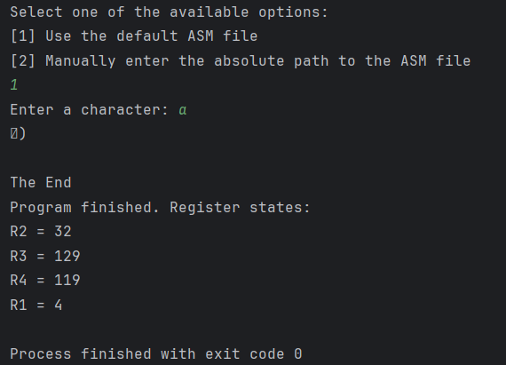

# Processor Emulator

## Project Overview

This project is an emulator of a simplified processor model. The emulator reads a file containing assembly code and interprets it instruction by instruction, simulating processor execution.

The processor is based on the **Harvard architecture**, which means that instruction memory and data memory are separated. It features **four 64-bit general-purpose registers**, a **program counter (PC)**, and a **64-bit address space** where each address holds one byte of data.

The project is implemented in **Java** and includes a full set of **JUnit unit tests** that verify the correctness of the emulator and its instruction set.

## Key Features

- **Memory Implementation:**
  The processor uses separate memories for instructions and data, following the Harvard architecture principle.

    - **Instruction Memory:**  
      Implemented as a **list of strings**, where each string represents one instruction from the program.

    - **Data Memory:**  
      Implemented as a **map of type `Map<Long, byte[]>`**, where each entry represents a memory block rather than a single byte.  
      This approach avoids storing every single address-value pair.  
      Instead, only the **starting address of each block** is stored, which saves memory, and the emulator calculates the exact address position within that block when needed.  
      Each block in this implementation is of size **8 bytes**, which is sufficient for running smaller test programs.  
      In real systems, block sizes are typically much larger, but here smaller blocks are used for simplicity and efficiency during emulation.

- **Instruction Set:**
    - **Arithmetic operations:** `ADD`, `SUB`, `MUL`, `DIV`
    - **Bitwise logical operations:** `AND`, `OR`, `NOT`, `XOR`
    - **Data transfer:** `MOV` (supports direct and indirect addressing)
    - **Branching and comparison:** 
      - `CMP` (compare the values of two registers and set condition flags) 
      - `JMP`, `JE`, `JNE`, `JGE`, `JL` (unconditional and conditional jumps,
        supporting both direct and indirect addressing)
    - **Input/Output operations:** `IN` (reads from keyboard), `OUT` (prints to screen)
    - **Control:** `HALT` (stops execution)

- **Testing:**
  JUnit unit tests verify the correctness of all methods implemented in the emulator.

## Program Demonstration

Below is screenshot showcasing the application in action:

### How to Use the Program

1. Open the project in **IntelliJ IDEA**.
2. Provide an input file containing the assembly code.
3. Run the application by executing the **Emulator** class.
4. When running the program, there are **two ways to specify the input file**:
    - **Default file:** The emulator automatically loads the default file whose path is defined in the project's **properties file**.
    - **Manual path entry:** You can manually enter the absolute path to the assembly file.
5. To verify correctness, run all **JUnit tests** from your IDE or using `mvn test`

## Acknowledgements / Inspired by

This project was implemented for educational purposes as part of a Computer Architecture course.